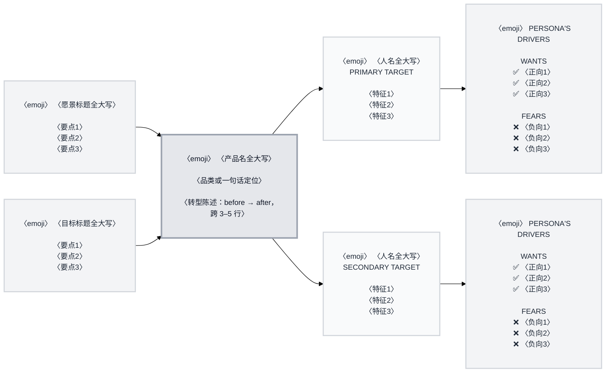

# Trigger Map 骨架（Effect Map 的唯一定义 · 收编自源 `wds-2-trigger-mapping/templates/trigger-map.template.md`）

> **用法**：本文件是**填值参照**，不是产物。填充目标是 `{output_dir}/wds-trigger.yaml` 的 `effect_map` 段
> （`nodes` / `connections` / `class_defs` / `diagram`）。**构图纪律的完整说明在 `steps/05-documents.md` 第 2 步**
> ——本文件是它的可填骨架，两处冲突时以步文件为准。
>
> **两形态（裁定 7）**：`wds-trigger.yaml` 是**单一源**，Mermaid 是**派生视图**。本骨架的 `〈…〉` 占位符一律从 YAML
> 的既有键取、**填完不留占位符**（引擎把产物里的未解析 `{…}` 令牌判 `TOKEN_UNRESOLVED`）；源侧原文件用的是
> Handlebars `{{…}}` 渲染语法——把渲染语言当自然语言写进指令，源侧 21 行已登记为缺陷，diy 不沿用。
>
> **条数自适应（裁定 6）**：驱动因素按 `driving_forces` 的实际条数渲染（每人正负各 3–5 条）；
> 目标群按 `personas[]` 的实际条数（2–4），**不假定恰三层**。

---

## 一、节点 ID 对照（0 基的图内 ID ↔ 1 基的产物 ID）

| 图内节点 | 产物 ID | 数量 | 序的来源 |
| --- | --- | --- | --- |
| `BG0`、`BG1`… | `BG-1`、`BG-2`…（`business_goals[]`） | = 目标数 | 数组序（**下标 0 在顶 = 最高优先级**） |
| `PLATFORM` | 无（产品名从 `wds-brief.yaml` 的 `brief.core.product_concept` 取） | **恒 1** | — |
| `TG0`、`TG1`… | `TG-1`、`TG-2`…（`personas[]`） | = 人物数 | 数组序 |
| `DF0`、`DF1`… | 该人物的 `driving_forces`（正 + 负） | = 人物数 | **与 TG 一一对应**（`TG<i>` ↔ `DF<i>`） |

---

## 二、完整 Mermaid 骨架（照此填）

**必守十条**（源 `08h` 的质检清单，逐条见 `steps/05-documents.md` 第 2 步五）：

1. 配置三行逐字（`base` 主题 / `Inter, system-ui, sans-serif` / `14px` / `flowchart LR`）。
2. 每节点 ` ` 起、`  ` 收。
3. 标题全大写；**无 HTML 标签**（粗体 / 斜体一律不用）。
4. 每群的 emoji 在 TG 与 DF 两处**同一个**；`WANTS` / `FEARS` 标题**不带 emoji**。
5. 正向一律 ✅、负向一律 ❌。
6. 驱动因素条数与产物一致（**不再截断到 3**：源侧「exactly 3」与采集端「3–5」冲突，本批取 3–5）。
7. 连接只用 `-->`；`TG<i> → DF<i>` 配对严格。
8. 连接数 = 目标数 + 2×人物数（`check` 与 `metrics` 都会核）。
9. 四条 `classDef` 逐字；平台边框 3px、其余 2px；**优先级只靠纵向顺序**，不得为某个节点加特殊样式。
10. 图内节点数 = `business_goals[]` 与 `personas[]` 的记录数（`nodes` 键与 `diagram` 不得漂移）。

---

## 三、emoji 取法（源 08b / 08d / 08c 的选型表，收编于此）

| 位置 | 取法 |
| --- | --- |
| 业务目标 | 按主题：收入 → 钱袋；满意度 → 笑脸；效率 → 闪电；增长 → 火箭；社区 → 星；指标 → 图表；合作 → 握手；目标 → 靶心 |
| 目标群 | 按人物类型：战略 / 主人物 → 靶心；商务 / 领导 → 公文包；技术 / 开发 → 电脑；团队 / 群体 → 人群；创意 / 设计 → 调色板；用户 / 客户 → 手机 |
| 平台 | 按产品类型：设计 / 创意 → 调色板；软件 / 技术 → 电脑；移动 / App → 手机；工具 → 锤钳；数据 / 分析 → 图表；AI / 自动化 → 机器人 |

---

_方法出处：Effect Mapping by Mijo Balic & Ingrid Domingues (inUse)，WDS 的改法是去特征、强化负向驱动因素。_
